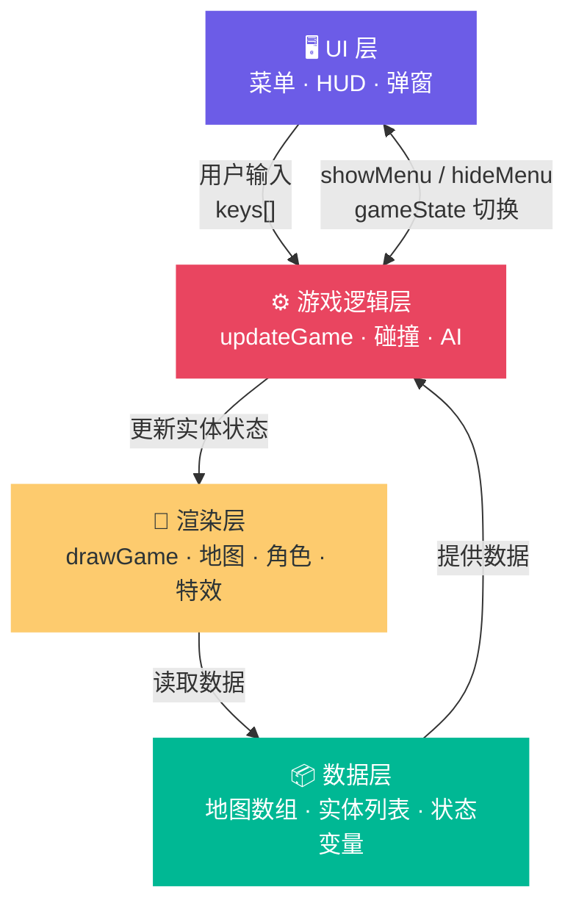
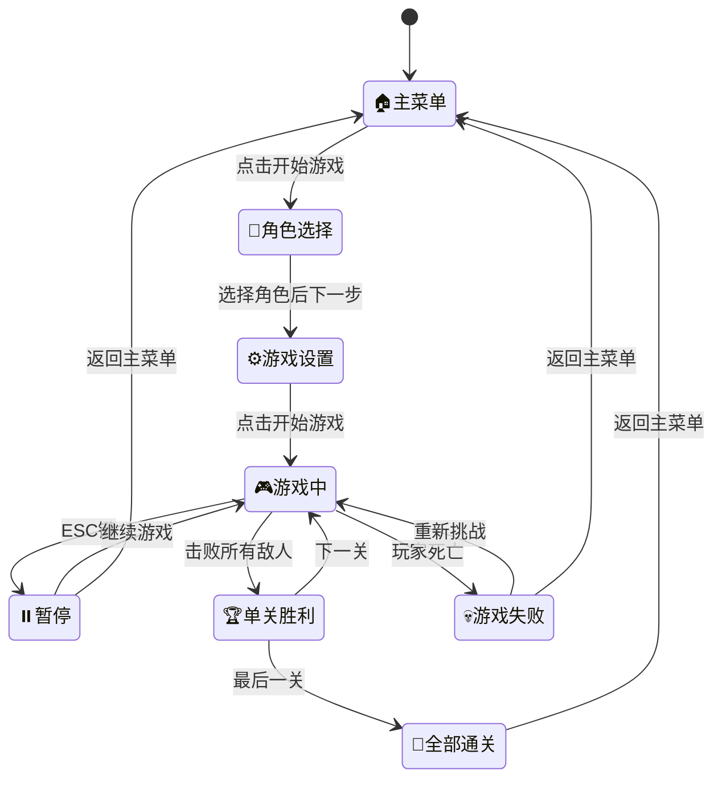
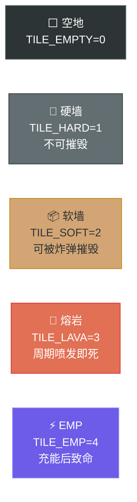
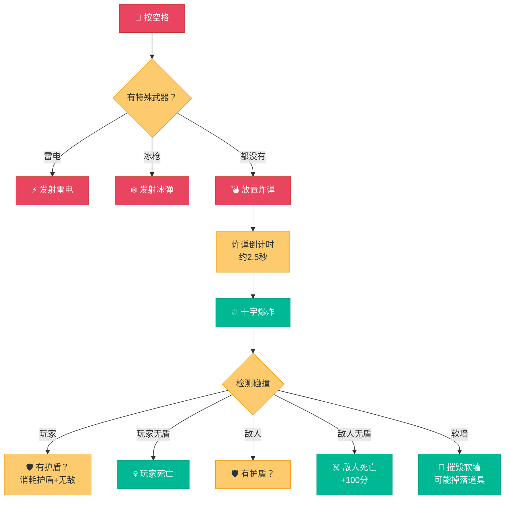
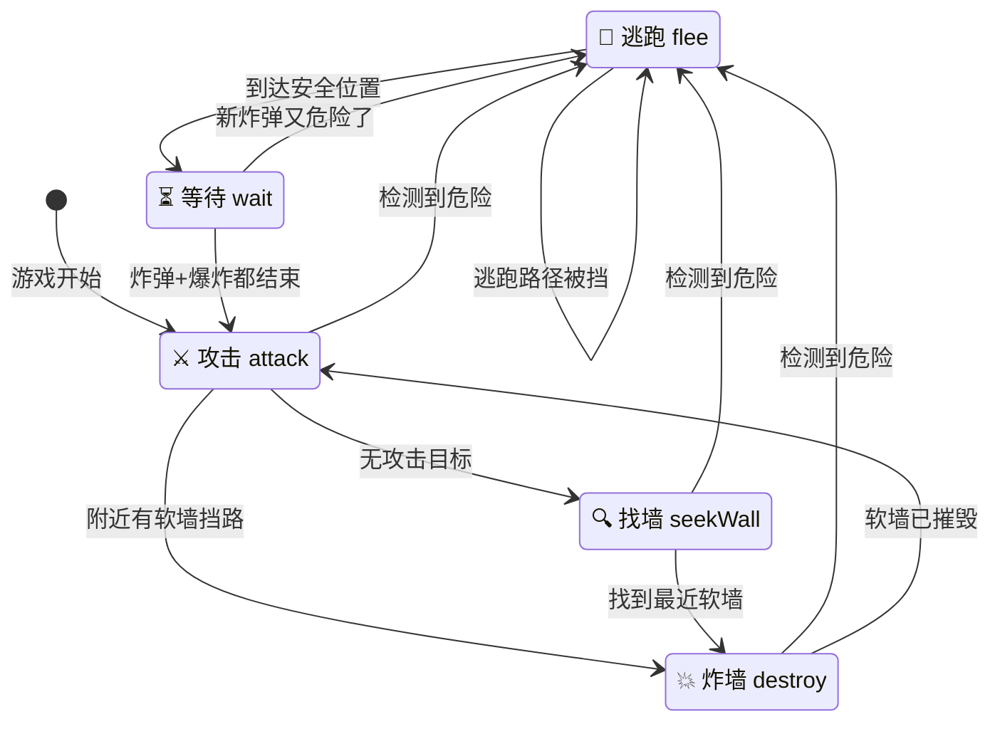
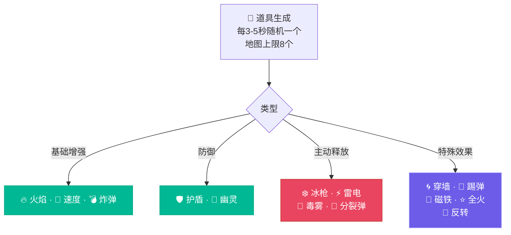
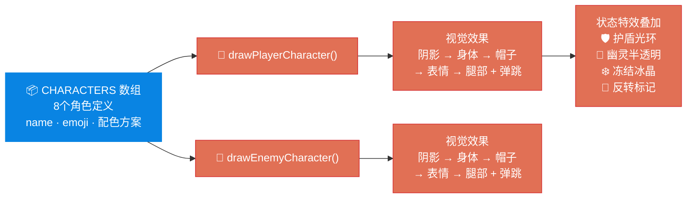
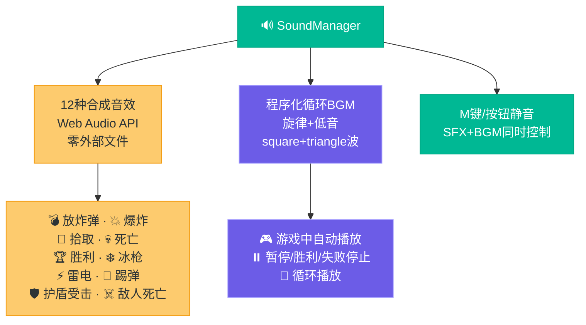
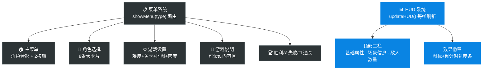
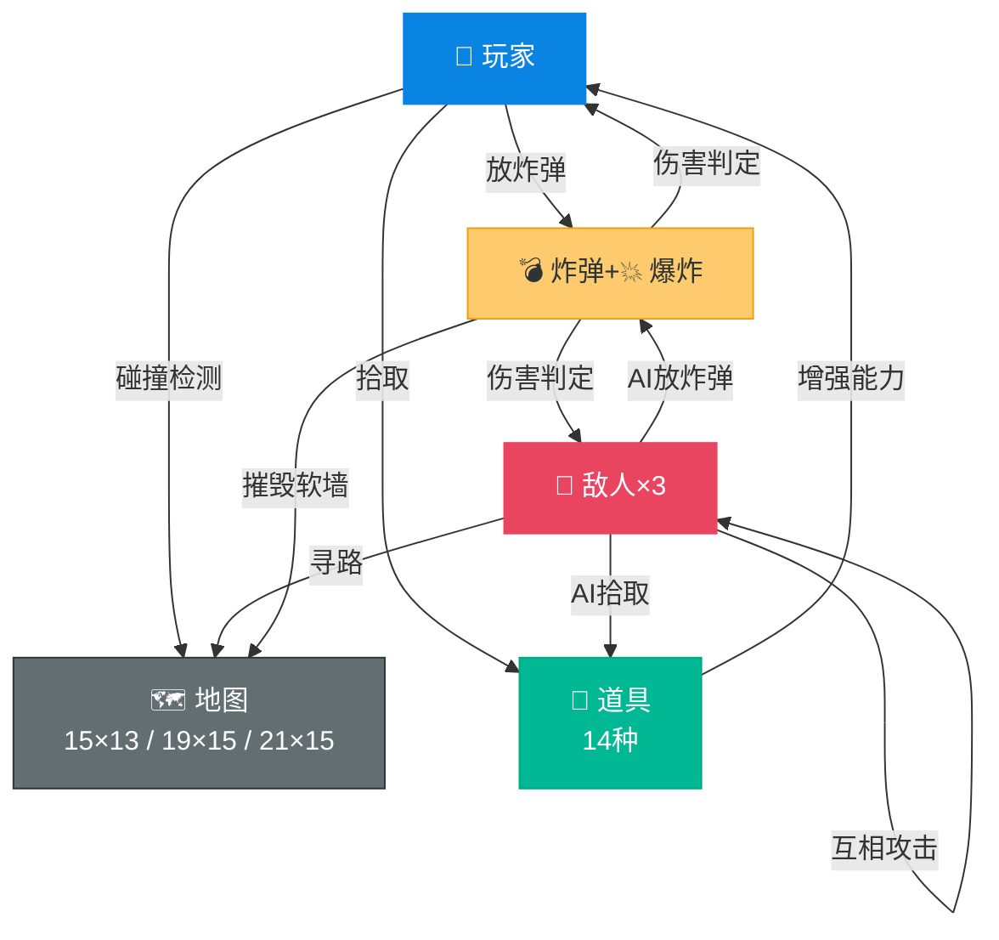

# 🎮 Q版泡泡堂 — 游戏开发总结与设计指南

> 基于本项目的完整开发经验，总结从零构建一款 HTML5 小型游戏所需的核心要素、设计原则与踩坑教训。

---

## 📊 项目概览

| 项目 | 详情 |
|------|------|
| 技术栈 | HTML5 Canvas + 原生 JavaScript，单文件架构 |
| 代码量 | ~3700 行（HTML + CSS + JS 混合） |
| 外部依赖 | 零依赖，浏览器直接打开即可运行 |
| 核心玩法 | 单人对战 3 个 AI 敌人，炸弹消除 + 道具收集 |
| 内容量 | 8 可选角色 · 14 种道具 · 9 种场景 · 5 种敌人配色 |

---

## 🏗️ 游戏架构总览



---

## 🧩 核心系统拆解

### 1. 🎯 游戏状态机



**关键设计**：用一个 `gameState` 字符串变量驱动所有状态切换，`showMenu(type)` 统一控制 UI 显隐。状态机不需要复杂框架，一个字符串 + 条件分支就够了。

---

### 2. 🗺️ 地图系统



**地图生成规则**：
- 网格：奇数列 × 奇数行（保证硬墙柱子对称）
- 硬墙：边界 + 内部偶数行列交叉点（经典炸弹人柱子模式）
- 软墙：基于密度百分比随机放置，避开出生点安全区
- 危险瓦片：仅在对应场景生成，数量按地图面积缩放

**设计教训**：
> ⚠️ **危险区域必须有视觉标记**。最初熔岩场景的伤害是随机在空地产生的，玩家无法预判。改为固定位置的 TILE_LAVA 瓦片后，玩家可以提前看到哪些格子有风险，做出策略选择。这是"可读性优先"原则的典型应用。

---

### 3. 💣 炸弹与爆炸系统



**爆炸范围格式统一**：
- 主爆炸：`{cells: [[c,r], [c,r], ...]}` — 十字形多格
- 分裂弹/EMP：`{col, row}` — 单格

**踩坑教训**：
> ⚠️ 两种格式曾导致 `checkExplosionHit` 只处理了 `cells` 格式，分裂弹完全无效。解决方案：统一函数同时处理两种格式，用 `cells || [[col, row]]` 兼容。

---

### 4. 🤖 AI 敌人行为系统



**AI 核心算法**：
- **逃生路径**：BFS 广度优先搜索，找到最近的安全格子
- **安全判定**：`isSafeCell` 检查 2×2 碰撞框区域，确保完全不在爆炸范围内
- **放炸弹决策**：`canEscapeAfterBomb` 先模拟放置炸弹，再检查是否有逃生路线
- **等待机制**：逃到安全位置后进入 wait 状态，等炸弹+爆炸伤害都结束后才恢复

**设计原则**：
> 🎯 **AI 必须"公平但不完美"**。敌人应该有挑战性，但不能做出人类做不到的操作（比如穿墙）。同时 AI 也需要"犯错"——不是每次都能完美逃跑，否则玩家永远赢不了。

---

### 5. 🎒 道具系统



**两类道具设计哲学**：
- **被动型**（拾取即生效）：护盾、穿墙、磁铁、幽灵、反转 — 简单直接
- **主动型**（存储后按空格释放）：冰枪、雷电、毒雾、分裂弹 — 给玩家控制权和策略性

> 💡 **主动释放优于拾取即用**。用户明确反馈"希望等用户按空格时再发出去，而不是捡到就直接发出去"。拾取即用让玩家感觉失去控制。

---

### 6. 🎨 角色渲染系统



**碰撞框 vs 视觉大小**：
- 碰撞框：格子的 70%（`halfSize = CELL * 0.35`）
- 视觉大小：格子的 90%
- 差异原因：视觉需要饱满好看，但碰撞需要留出通道空间

---

### 7. 🔊 音效系统



**技术要点**：
- `AudioContext` 需要用户交互才能启动 → 在首次按键/点击时 `init()`
- 音效用临时 OscillatorNode，播放完自动断开，不占资源
- BGM 用提前调度（look-ahead）模式，避免卡顿

---

### 8. 🖥️ UI 系统



---

## 🎯 游戏开发核心设计原则

### 原则 1：可读性 > 花哨效果

玩家必须能在**不看说明**的情况下理解游戏状态。

| ✅ 正确做法 | ❌ 错误做法 |
|------------|------------|
| 熔岩瓦片有固定位置+视觉标记 | 随机空地产生伤害 |
| EMP 充能时有 ⚠️ 警告+进度条 | 突然激活杀死玩家 |
| 护盾有蓝色光环特效 | 护盾只有文字显示 |
| 敌人冻结有冰晶动画 | 冻结无任何视觉反馈 |

### 原则 2：玩家控制感 > 自动化

让玩家**主动选择**时机，而不是被系统自动触发。

- 攻击道具：存储后按空格释放（非拾取即用）
- 放炸弹前：检查逃生路线（`canEscapeAfterBomb`）
- 倒计时：3-2-1 冻结一切，给玩家准备时间

### 原则 3：渐进式复杂度

不要一开始就给玩家所有内容，让体验**逐步展开**。

- 关卡数可选（3/5/7/9），新手可以先玩 3 关
- 难度可选（简单/普通/困难），降低入门门槛
- 场景随机不重复，每局都有新鲜感
- 道具种类丰富但出现有概率权重，不会一下子全部出现

### 原则 4：公平的 AI

敌人应该**有挑战但可被击败**。

- AI 有 5 种状态（逃跑/等待/攻击/炸墙/找墙），行为丰富但可预测
- AI 也需要逃生路线检查（`canEscapeAfterBomb`），不能做出人类做不到的事
- AI 互相攻击（`findNearestTarget`），玩家可以利用这一点
- 难度系统影响 AI 速度和攻击概率，但不改变 AI 逻辑本身

### 原则 5：视觉反馈链

每个游戏事件都必须有**完整的视觉+音效反馈**。

```
玩家放炸弹 → 💣 放置音效 + 炸弹出现
炸弹爆炸   → 💥 爆炸音效 + 十字火焰动画
敌人死亡   → ☠️ 死亡音效 + 得分 +100
拾取道具   → 🎁 拾取音效 + 效果激活 + 徽章显示
玩家死亡   → 💀 死亡音效 + 游戏失败画面
通关胜利   → 🏆 胜利音效 + 烟花 + 彩纸 + 星级评价
```

---

## ⚠️ 开发中的关键踩坑教训

### 坑 1：碰撞框与视觉大小不一致

**问题**：碰撞框 70%，视觉 90%，导致"看起来没碰到但实际上碰到了"。

**教训**：碰撞检测必须使用**前沿格子检测**（只检查移动方向的前沿），而不是四角检测。四角检测会导致角色在通道中间碰到上下墙壁而卡住。

### 坑 2：爆炸格式不统一

**问题**：主爆炸用 `{cells: [[c,r],...]}`，分裂弹用 `{col, row}`，伤害检测只处理了一种格式。

**教训**：同类系统的数据格式必须统一，或者在处理函数中明确兼容所有格式。写完后**立即测试每种来源**。

### 坑 3：穿墙结束卡死

**问题**：穿墙道具到期时如果玩家在软墙内部，直接被卡死。

**教训**：任何"临时改变物理规则"的效果，结束时必须**检查当前状态是否合法**。如果不合法，需要自动修正（推到最近空地）。

### 坑 4：敌人护盾无效

**问题**：敌人拾取护盾后被炸还是一击必死，因为爆炸伤害代码跳过了护盾检查。

**教训**：所有伤害来源（爆炸、滑行炸弹、毒雾、熔岩、EMP）都必须**统一走护盾检查逻辑**。新增伤害来源时，必须同步更新所有相关检查。

### 坑 5：危险区域无标记

**问题**：熔岩场景的伤害在看起来安全的空地随机产生。

**教训**：**所有危险都必须有视觉标记**。玩家可以接受"我看到了危险但没躲开"，但无法接受"看起来安全的地方突然死了"。

### 坑 6：倒计时期间可操作

**问题**：关卡开始时玩家可以立即移动，AI 也可以行动。

**教训**：关卡切换后必须有**冻结期**（倒计时），让玩家有时间了解当前场景和环境。否则"刚加载完就被炸死"。

---

## 📋 从零写一个游戏的 Checklist

### 🏁 立项阶段
- [ ] 核心玩法一句话描述清楚
- [ ] 技术选型（Canvas/DOM/WebGL，单文件/模块化）
- [ ] 最小可玩版本定义（MVP 有哪些功能）

### 🎮 核心玩法
- [ ] 玩家移动+碰撞检测
- [ ] 核心交互机制（本项目：放炸弹+爆炸）
- [ ] 敌人/障碍物 AI
- [ ] 胜负判定条件
- [ ] 道具/能力系统
- [ ] 关卡/场景设计

### 🎨 视觉表现
- [ ] 角色渲染（动画、状态特效）
- [ ] 地图渲染（瓦片、装饰、特效）
- [ ] 爆炸/技能等粒子效果
- [ ] UI 菜单系统（主菜单、设置、暂停、结算）
- [ ] HUD（得分、状态、道具显示）
- [ ] 响应式缩放（适配不同屏幕）

### 🔊 音效音乐
- [ ] 核心动作音效（放炸弹、爆炸、拾取、死亡）
- [ ] 胜利/失败音效
- [ ] BGM 背景音乐
- [ ] 静音开关

### ⚖️ 平衡与体验
- [ ] 玩家初始状态确保可生存（安全区、倒计时）
- [ ] 难度曲线合理（渐进式增加挑战）
- [ ] AI 公平（可被击败、不作弊）
- [ ] 危险区域有视觉标记
- [ ] 所有状态变化有视觉+音效反馈
- [ ] 临时效果结束时检查状态合法性

### 🧪 测试要点
- [ ] 每种道具的基本功能
- [ ] 每种场景的特殊机制
- [ ] 边界情况（穿墙到期、护盾耗尽、倒计时期间）
- [ ] AI 行为（逃跑、攻击、互相伤害）
- [ ] 不同地图大小+密度组合

---

## 📊 系统交互关系图



---

## 🎯 一句话总结

> **好的小游戏 = 清晰的核心循环 + 公平的 AI + 丰富的道具 + 即时的反馈 + 可读的界面。**

从泡泡堂这个项目来看，技术实现只占 30%，剩下的 70% 是**设计决策**：危险区域怎么标记、AI 什么时候该犯错、道具是拾取即用还是主动释放、倒计时该多长……这些"小细节"加起来，决定了游戏是"能玩"还是"好玩"。
